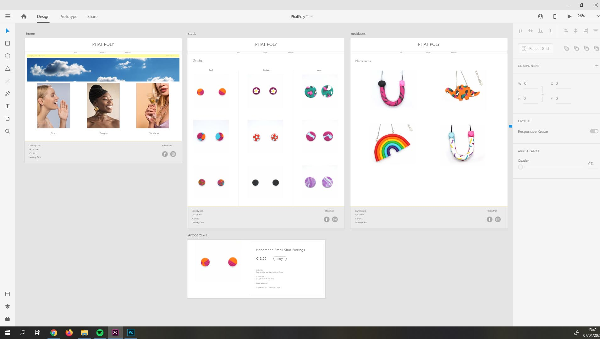
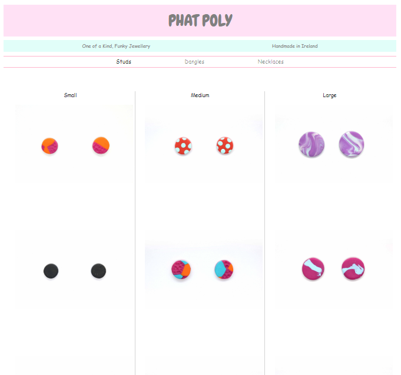

# First Milestone Project
***
## Phat Poly Handmade Jewellery Website
[Phat Poly deployment click here](httsp://mikevez.github.io/Milestone1/)
***
### Site Description
This project consisted of creating a Website that displays 3 types of handmade jewellery across 3 pages, studs, dangles and necklaces. The website is a Front End construction only and was assembled using only HTML5 and CSS.

The website provides a place where people can browse and purchase jewellery by type and size. Each product contains a pictue and description.

### UX
***
The website is aimed at somebody looking for handmade, colourful or funky jewellery. As the jewellery itself is very colourful so the idea was to create a minimal style layout with subtle pastel colours, as to not take from the jewellery itself or overwhelm the user. All the main areas are kept white and pastel pinks and blue are used thoughout for menus.

The font used in the main logo 'Phat Poly' is called 'Chewy' was imported from Google fonts as this is the actual font used on actual Phat Poly logos and packaging. The rest of the website's font uses 'Spartan', due to its simple and easy to read nature, this was also imported from Google fonts.

A prototype layout was constructed using Adobe xD software. Displayed below is the first prototype for the layout without the final colours or pictues. The prototype used stock images on the home page taken from Pexels (describted in Technologies section)

The final website design used Bootstrap in the nav bar in order to simplify 
the layout on a mobile device by collapsing the navigation menu and in the footer to change the display depending on the screen size.

***

The home page and stud page of the final website front end build is displayed below. All pictures
were taken by myself.

***
***

## Features
***
The website opens to a home page containing 3 large images which direct the user to which type of jewellery they want to navigate to. The 3 product pages have a similar grid style layout displaying each product with a brief description below.

The navigation bar collapses to a hamburger icon when used on a mobile, allowing the user to select their desired page and as well jump to a particular section on the page (small, medium or large products) to avoid lenthy scrolling. 

The footer contains a simple site map which highlights all the clickable pages. Also contained within the footer are the social media links linking to the appropriate sites.

## Features Left to Implement
The website in the future will also contain a way of purchasing the products as well as a contact form where customers can send a message and possibly another page for an extra product.
***
***

## Technologies used
***
* The web pages in this project were structured using HTML5.
* The content and pages were styled using CSS.
* [Bootstrap](https://getbootstrap.com/) was used to control the collapsing
navbar for mobile use as well as in the footer to control the layout when displayed on a mobile device. Bootstrap was also used to control the widths of the display columns that held the products.
* Most of the code research was done using [w3schools.com](www.w3schools.com).
* All the code was produced using [GitPod](https://www.gitpod.io/) within the Chrome Browser.
* [Github](https://github.com/) was used to host all the files in the deployed website.
* [Adobe xD](https://www.adobe.com/ie/products/xd.html) is a free Adobe product which was used to design all mockups and prototypes before building the website.
* [Adobe Photoshop](https://www.adobe.com/ie/products/photoshop.html) was used to colour buttons and various images within the website.

***
***
## Testing
***
The finished Front End Project was tested using Google Chrome, Internet Explorer and FireFox. The website was tested using a mobile-first approach. The website functioned as expected in every browser except Internet Explorer. Internet Explorer caused the website colours on the navigation bar and footer not to display, but besides this issue the site functions as expected. Unfortunally I didn't have enough time to troubleshoot the Internet Explorer issue and hope to have it rectified in the future.

***
***
## Acknowledgments
***
I would like to thank my mentor Maranatha Ilesanmi for the help with the website layout and implemention at such short notice.