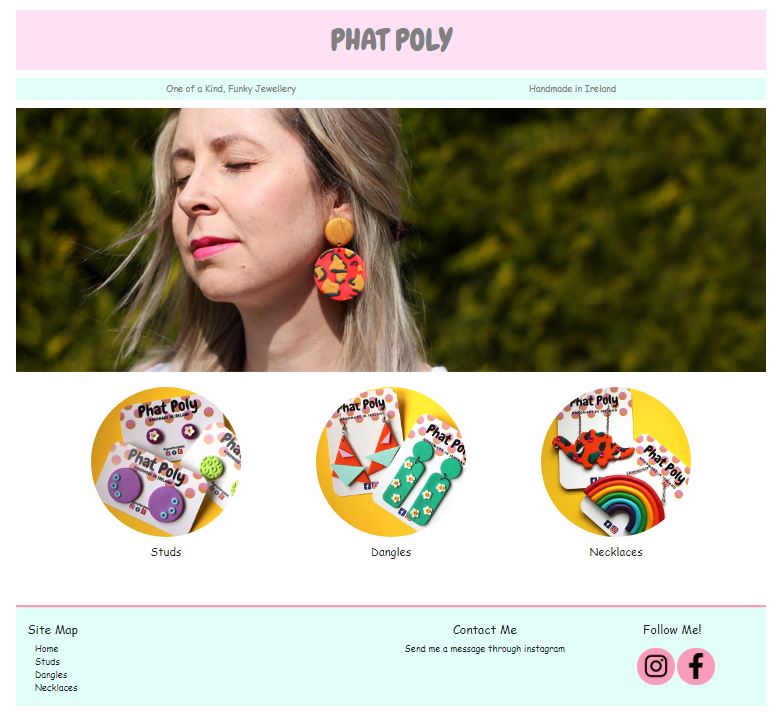
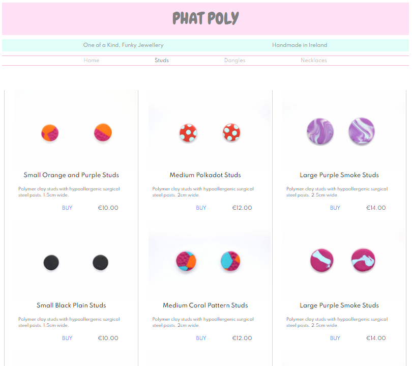

# First Milestone Project
***
## Phat Poly Handmade Jewellery Website
***
### Site Description
The idea was to create a website to display jewellery in which customers could purchase through the site. 
The site would be divided amongst 4 pages; a home page and 3 product pages to display the 3 differnt types 
of jewellery (studs, dangles and necklaces). The site itself uses bright pastel colours to keep in theme 
with the colourful jewellery.

### UX
A prototype layout was constructed using Adobe xD software. Displayed below is the
first prototype for the layout without the final colours.

The final website design used Bootstrap in the nav bar in order to simplify 
the layout on a mobile device by collapsing the navigation menu and in the footer
to change the display depending on the screen size.

The font used in the main logo 'Phat Poly' called 'Chewy' was imported from Google
fonts.

The home page and stud page of the final website front end build is displayed below. All pictures
were taken by myself.

***
## Technologies used
This front end project was built using HTML5 and CSS within Gitpod.
Most of the code research was done using [w3schools.com](www.w3schools.com).

[Bootstrap](https://getbootstrap.com/) was used to control the collapsing
navbar as well as in the footer to control the layout when displayed on a mobile
device. Bootstrap was also used to control the widths of the display columns that
held the products.

All the code was produced using [GitPod](https://www.gitpod.io/) within the Chrome Browser.

[GitHub](https://github.com/) was used to deploy to site and also host all files and repositories.